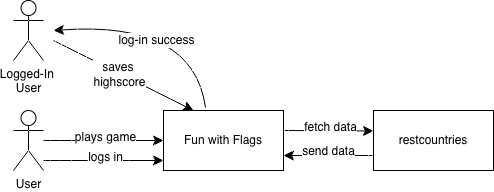
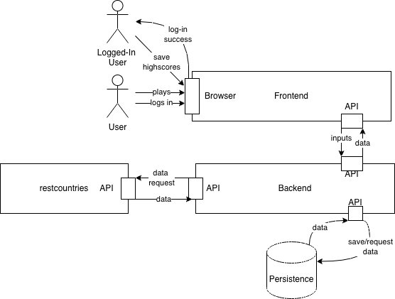

# Context and Scope

## Business Context

The "Spaß mit Flaggen" system interacts with two types of human users and one external IT system. The core function involves presenting flag data to users, letting them test their geographical knowledge and save their highscores.
The system relies on an external service to fetch information about countries and their flags. The human users interact with the system via a web browser to play the game and view their scores.

| Element | Describtion |
|----------------------|---------------|
| **User** | Guesses for countries based on displayed flags. Receives random flags and immediate feedback (correct/incorrect) for the current session. |
| **Logged-In User** | Login credentials, country guesses, requests for high scores. Receives flags, feedback, and persistent personal high score data. |
| **restcountries** | Request for random country/flag data from backend. JSON response containing country names and flag URLs. |

## Technical Context

The application follows a standard web-based 3-tier architecture. The frontend is delivered to the user's browser, communicating with the backend via REST API calls. The backend acts as the central orchestrator, communicating with both the persistence layer (database) and the external API.

| Element | Describtion |
|----------------------|---------------|
| **User / Logged-In User** | Plays the game in his browser based on displayed flags in the frontend. Logs in and saves highscores by using the frontend mask. | 
| **Frontend** | Webapplication that allows User-Interaction and visualizes the app | 
| **Backend** | Server that fetches data from the external service and sends the results to the frontend. Handles and calculates results of user inputs into the frontend. Saves and requests data from the persistence|
| **Persistence** | Saves user information and highscores|
| **Restcountries** | External services that provides country data, including pictures of the flags|

**Mapping Input/Output to Channels:**

| Channel | Input/Output | Protocol |
|---------|-------------|----------|
| **User Browser <-> Frontend+Backend** | Frontend delivery, API calls for gameplay (public endpoint) and user authentication/high scores (secured endpoint). | HTTP / HTTPS |
| **Backend <-> Persistence Layer** | SQL queries to read and write user data, login credentials, and highscores. | TCP/IP |
| **Backend <-> restcountries.com API** | Fetching external country data. This connection needs to use fail-safes to handle potential downtimes of the external service | HTTPS / REST |