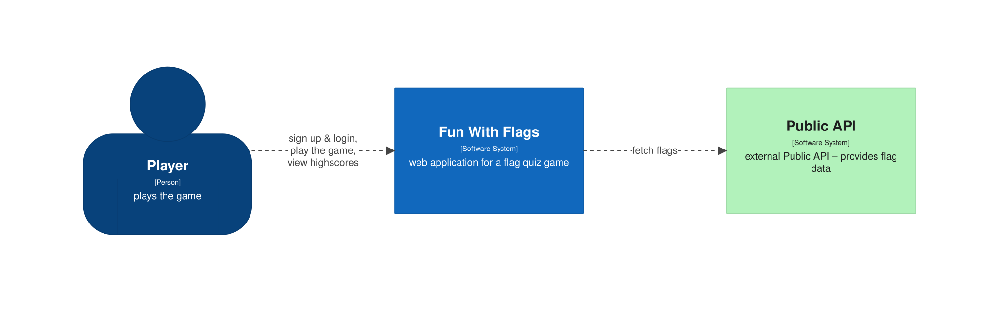
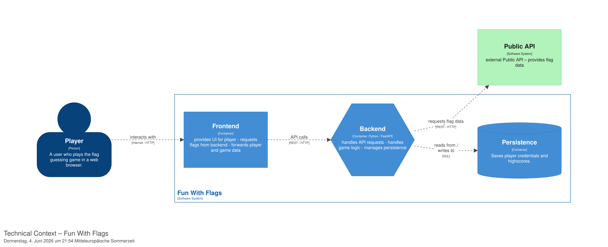

# Context and Scope

## Business Context

| Element | Description |
| ---------------------- | --------------- |
| **Player** | Can sign up/login into the application. Can check the highscores of all players.  Plays the game |
| **Fun With Flags** | Handles game logic. Requests country information from public API |
| **Public API** | Provides flag names and images |

## Technical Context

The application follows a standard web-based 3-tier architecture. The frontend is delivered to the Player's browser, communicating with the backend via REST API calls. The backend acts as the central orchestrator, communicating with both the persistence layer (database) and the external API.

| Element | Description |
| ---------------------- | --------------- |
| **Player** | Accesses the application via internet |
| **Frontend** | Provides a user interface for the Player. makes internal API calls to fetch or save data |
| **Backend** | Uses REST calls to fetch data from the Public API. Queries the Persistence Component for stored data |
| **Persistence** | provides player information, highscores and flag information |
| **Public API** | public interface to provide flag information |
