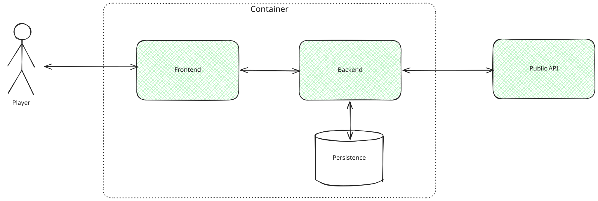
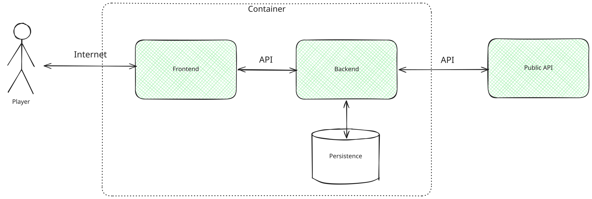

# Context and Scope

## Business Context

| Element | Description |
| ---------------------- | --------------- |
| **Player** | Can sign up/login into the application. Can check the highscores of all players.  Plays the game |
| **Fun With Flags** | Handles game logic. Requests country information from public API |
| **Public API** | Provides flag names and images |

## Technical Context

The application follows a standard web-based 3-tier architecture. The frontend is delivered to the user's browser, communicating with the backend via REST API calls. The backend acts as the central orchestrator, communicating with both the persistence layer (database) and the external API.

| Element | Describtion |
|----------------------|---------------|
| **User / Logged-In User** | Plays the game in his browser based on displayed flags in the frontend. Logs in and saves highscores by using the frontend mask. | 
| **Frontend** | Webapplication that allows User-Interaction and visualizes the app | 
| **Backend** | Server that fetches data from the external service and sends the results to the frontend. Handles and calculates results of user inputs into the frontend. Saves and requests data from the persistence|
| **Persistence** | Saves user information and highscores|
| **Restcountries** | External services that provides country data, including pictures of the flags|

**Mapping Input/Output to Channels:**

| Channel | Input/Output | Protocol |
|---------|-------------|----------|
| **User Browser <-> Frontend+Backend** | Frontend delivery, API calls for gameplay (public endpoint) and user authentication/high scores (secured endpoint). | HTTP / HTTPS |
| **Backend <-> Persistence Layer** | SQL queries to read and write user data, login credentials, and highscores. | TCP/IP |
| **Backend <-> restcountries.com API** | Fetching external country data. This connection needs to use fail-safes to handle potential downtimes of the external service | HTTPS / REST |
