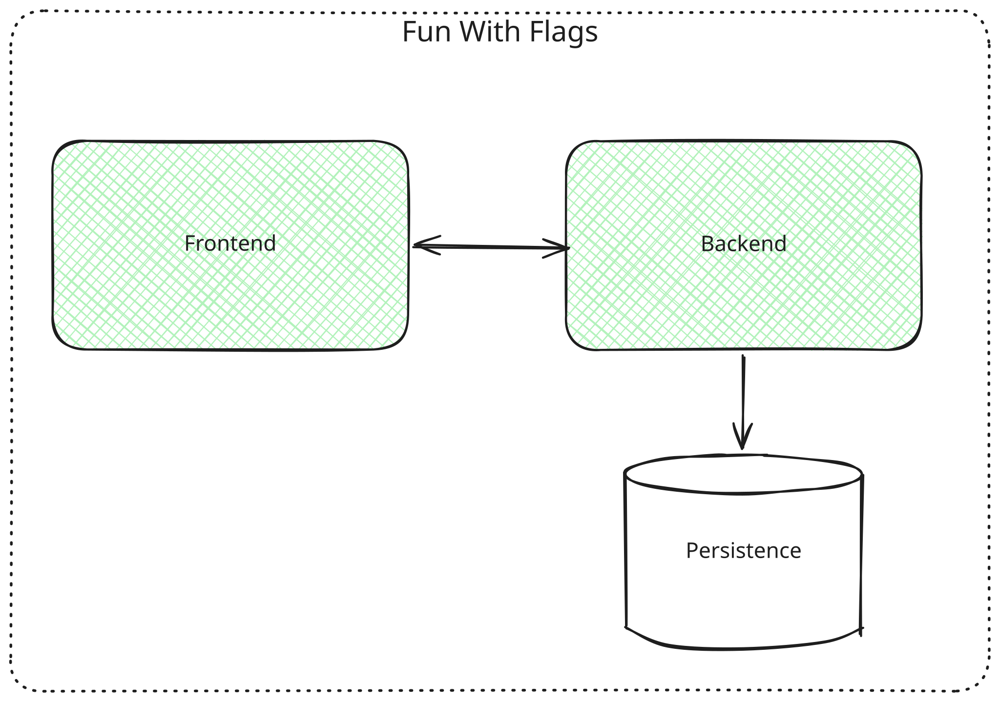

# Building Block View

## Level 1: Overall System

| Building Block | Description |
| ---------- | ------------- |
| **Player** | Signs up/Login into application. Plays the game. Accesses public endpoints provided by **Fun With Flags** |
| **Fun With Flags** | Includes the game, highscores and public endpoints |
| **Pulbic API** | Provides a public endpoint the application can access. In our case it's *restcountiers.com* |

## Level 2: Fun With Flags Whitebox

| Building Block | Description |
| ---------- | ------------- |
| **Frontend** | Provides user interface. Handles game logic. Requests and receives data from the Backend API |
| **Backend** | Responds to API calls from the Frontend. Reads/Writes data to the Persistence Component. Requests data from the Public API |
| **Persistence** | Stores player information, high scores and flag information |
