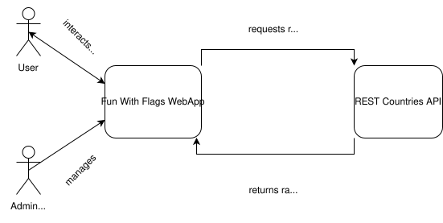

# Building Block View

## Level 1: Whitebox Overall System

### Motivation

*The application is divided into a frontend, showing the flag game to the user, and a backend which handles calls from the frontend securely and requests and receives flag data from the external CountriesAPI*

### Fun With Flags Web-App 
Implements the flag guessing game for the user and makes calls to the countries API*

### RESTCountries API
External service responding to calls, providing data about countries (i.e. names, flag pngs)*

---

## Level 2

### Fun With Flags Frontend
Web View facing the user. Shows a random country's flag and asks the user to guess the country's name. Guessing correctly will increase a user's score. Requests and receives data from the Fun with Flags Backend REST API.

### Fun With Flags Backend
Responds to API calls from the Frontend. Reads/Writes data to the Fun With Flags Database. Requests and receives data from the Countries API.

### Fun With Flags DB
Relational Database storing user information i.e. name, login data and game scores.

### RESTCountries API
External service responding to backend calls, providing data about countries (i.e. names, flag pngs)

---

