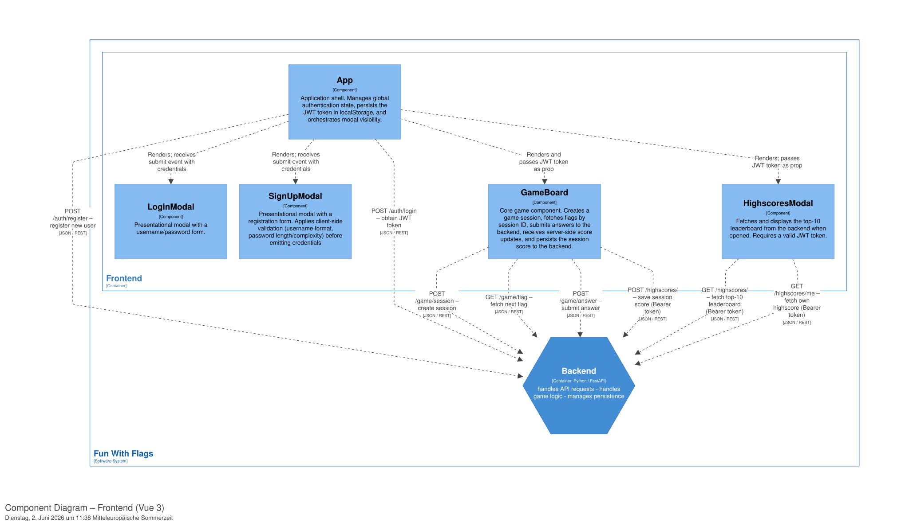
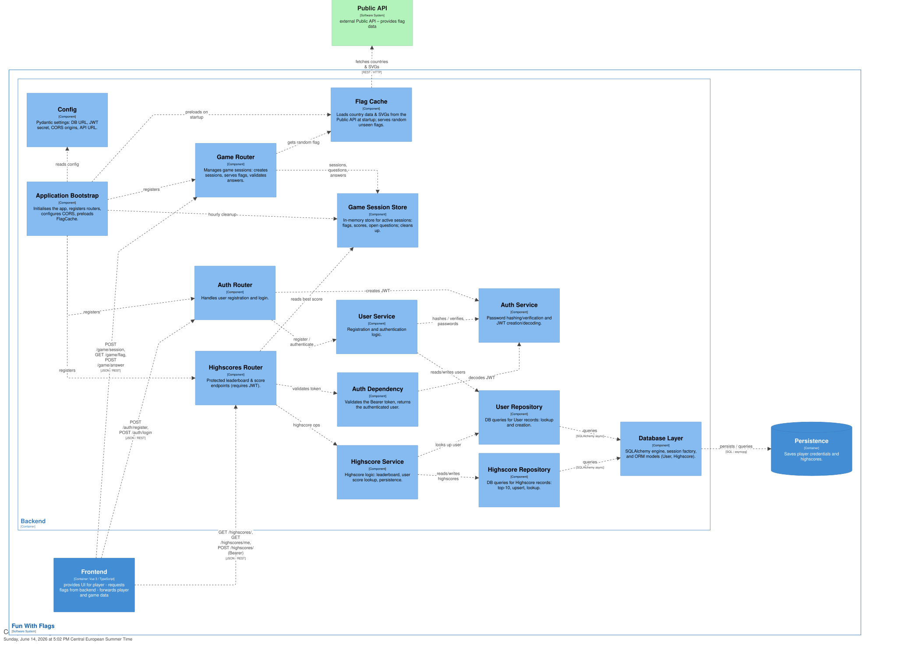

# Building Block View

The application follows a standard web-based 3-tier architecture. The frontend is delivered to the Player's browser, communicating with the backend via REST API calls. The backend acts as the central orchestrator, communicating with both the persistence layer (database) and the external API.

## Level 1: Overall System

| Element | Description |
| ---------------------- | --------------- |
| **Player** | Accesses the application via internet |
| **Frontend** | Provides a user interface for the Player. makes internal API calls to fetch or save data |
| **Backend** | Uses REST calls to fetch data from the Public API. Queries the Persistence Component for stored data |
| **Persistence** | provides player information, highscores |
| **Public API** | public interface to provide flag information |

## Level 2: Frontend

## Level 2: Backend

