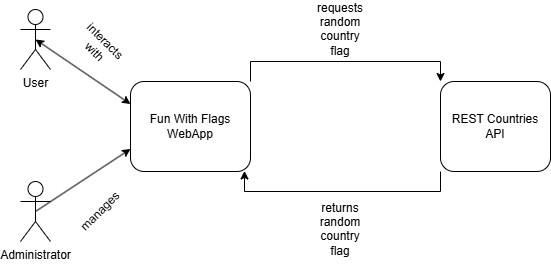

# Building Block View

## Whitebox Overall System

***\<Overview Diagram\>***

**Motivation**

*\<text explanation\>*

**Contained Building Blocks**

*\<Description of contained building block (black boxes)\>*

**Important Interfaces**

*\<Description of important interfaces\>*

### \<Name black box 1\>

*\<Purpose/Responsibility\>*

*\<Interface(s)\>*

*\<(Optional) Quality/Performance Characteristics\>*

*\<(Optional) Directory/File Location\>*

*\<(Optional) Fulfilled Requirements\>*

*\<(optional) Open Issues/Problems/Risks\>*

### \<Name black box 2\>

*\<black box template\>*

---

## Level 2

### White Box *\<building block 1\>*

*\<white box template\>*

### White Box *\<building block 2\>*

*\<white box template\>*

---

## Level 3

### White Box \<building block x.1\>

*\<white box template\>*

### White Box \<building block x.2\>

*\<white box template\>*
