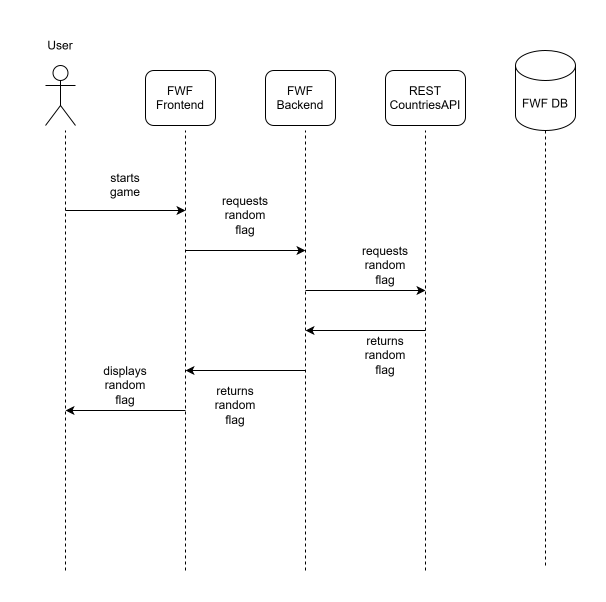
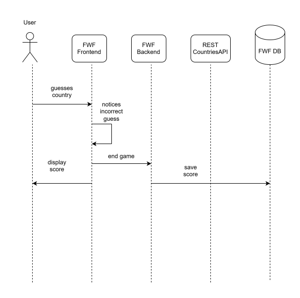
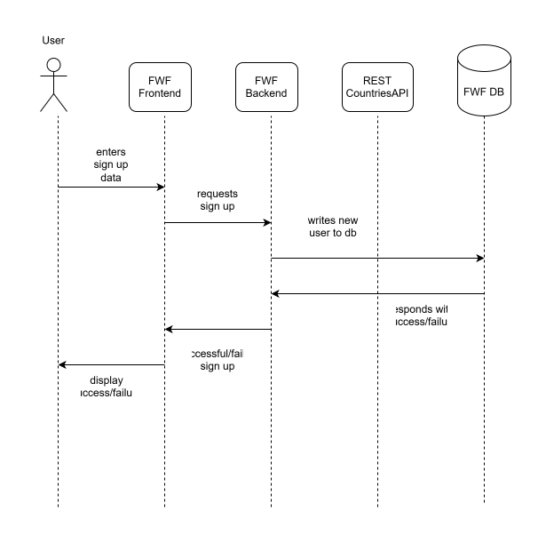
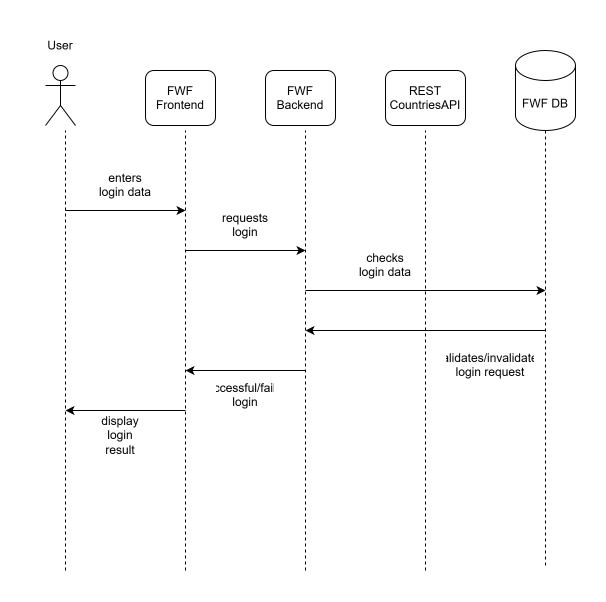

# Runtime View

## Fetch Flag 

The user starts the game or the user has just guessed a country correctly. The frontend 
requests a new flag image from the FWF backend, which delegates the request to the external RESTCountries API. The flag image as well as the corresponding country's name is returned to the backend which forwards it to the frontend. The new random flag is displayed to the user.
## Guess Country - Correct Guess 

The user guesses a country by typing text. The guess is evaluated in memory in the FWF frontend. The correct guess is validated, the user's score incremented and a success notification is sent to the user.
## Guess Country - Incorrect Guess 

The user guesses a country by typing text. The guess is evaluated in memory in the FWF frontend.
The incorrect guess is identified, the guessing game is ended and the user's score is shown on screen. 
## Sign Up

The user requests sign up by entering corresponding data. The frontend forwards the data to the FWF backend, writing the user's data to the FWF database. The backend returns success/failure messages to the frontend which displays the result to the user.
## Login

The user enters login data. The FWF frontend forwards the data to the FWF backend. The database is queried, checking if the user's login data is valid. A success failure message is sent by the backend; the user sees the result displayed by the frontend.