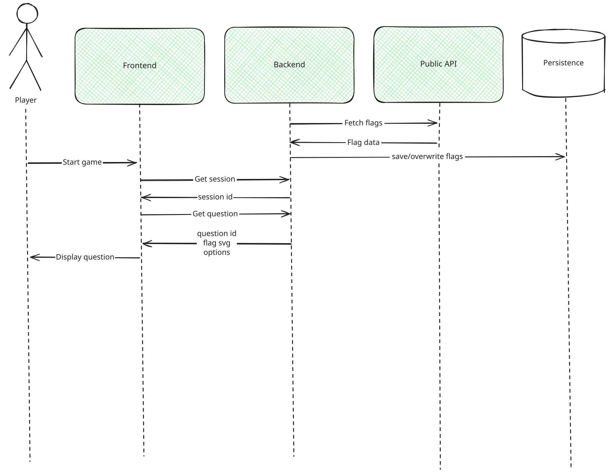
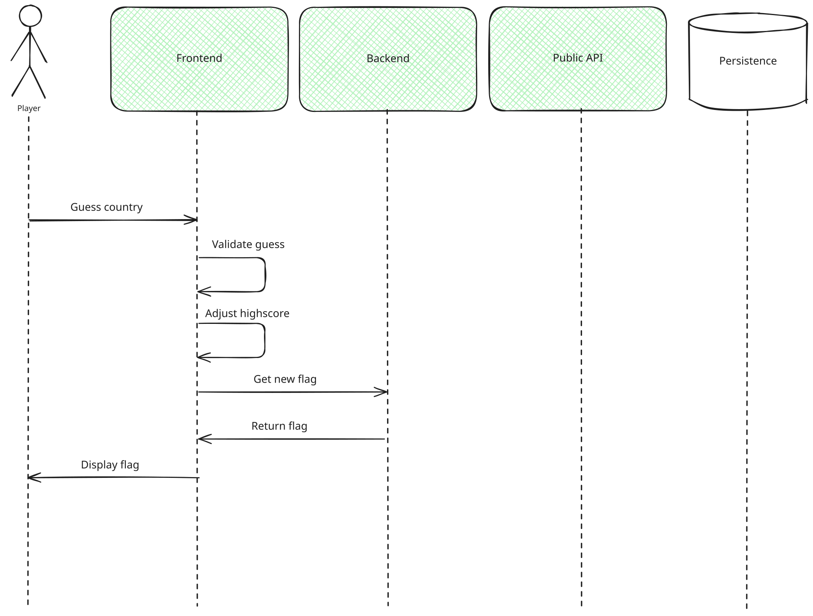
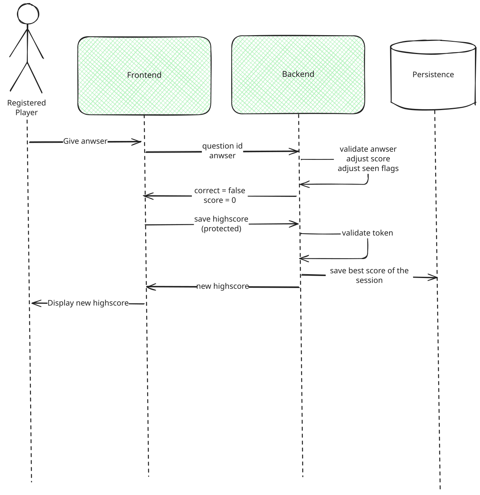
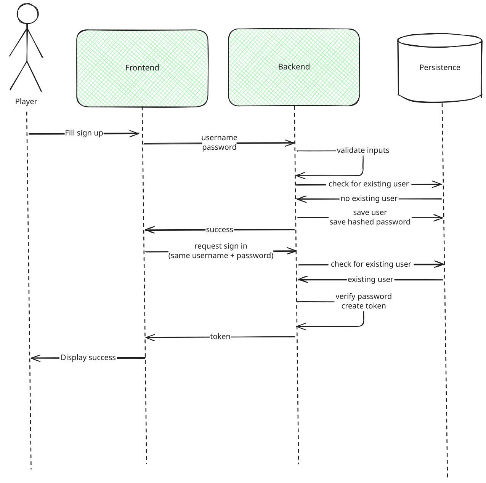

# Runtime View

## Fetch Flag

On application startup, the Backend fetches all country data and flag images from the public API and stores them exclusively in-memory (`FlagCache`). The cache is loaded once at startup and serves all flag requests for the lifetime of the process.

The player starts a game by creating a session. The Frontend then requests the next flag. The Backend picks a random unseen country from the in-memory `FlagCache` and returns the flag SVG inline along with four answer options and a `question_id`. The correct answer is stored server-side and never sent to the client.

## Guess Country - Correct Guess

We assume that the flags are already cached in the backend.

The Player guesses a country. The Frontend submits the answer to the Backend. The Backend validates the answer server-side, increments the session score by 1, and returns it to the Frontend. The Frontend then requests a new flag to start the next round.

## Guess Country - Incorrect Guess

The Player guesses a country. The Frontend submits the answer to the Backend. The Backend validates the answer server-side, resets the session score to 0, and returns it to the Frontend. The correct answer is shown to the Player. If the player had a score greater than 0, the backend writes the score to the database, provided the score exceeds the player's previous highscore.
## Sign Up and Login

The Player requests sign up by entering corresponding data. The Frontend forwards the data to the Backend. The Backend checks if the user already exists. If no user exists, a new one will be created and the Player will be notified.

If the user already exists, the Player will be notified respectively and no new user will be stored in the Persistence component.

### Input Validation

The sign-up data is validated on **two layers**:

- **Client-side (Frontend, sign-up only):** the `AuthModal` validates the input before any request is sent, giving the Player immediate feedback. The username must be at least 3 characters and contain only letters, digits and underscores; the password must be at least 8 characters and contain at least one digit. The login form performs no client-side checks and forwards the credentials as entered.
- **Server-side (Backend, authoritative):** the Backend re-validates every `POST /auth/register` request via its Pydantic schema, independently of the client. The username must be 3–50 characters and match the pattern `^[a-zA-Z0-9_-]+$`; the password must be at least 8 characters and must not be blank. Any violation is rejected with **HTTP 422** *before* the existence check, so no invalid or malicious input (e.g. SQL injection or XSS payloads) ever reaches the Persistence component.

Because the server-side rules are authoritative, the Player cannot bypass validation by calling the API directly or tampering with the Frontend. The login request (`POST /auth/login`) carries no field constraints — instead, the Backend verifies the supplied password against the stored hash and responds with **HTTP 401** if the username is unknown or the password does not match.

After a successful sign up, the Frontend automatically triggers a login with the same credentials. The Backend validates the credentials, creates a JWT token and returns it to the Frontend. From this point on, the Player is authenticated and the token is used for all protected requests (e.g. saving a highscore).
