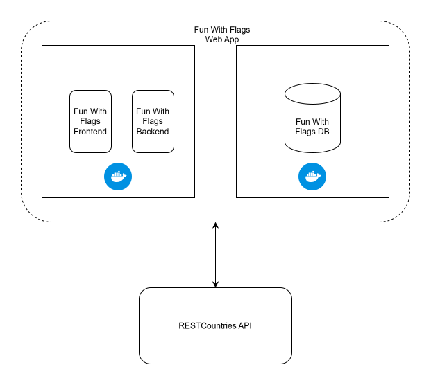

# Deployment View

## Motivation
Two Docker containers are used for the Fun With Flags Web App. One for the front- and backend which are bundled together and one for the Fun With Flags Database. The containers are composed via docker-compose. The RESTCountries API is provided externally.
